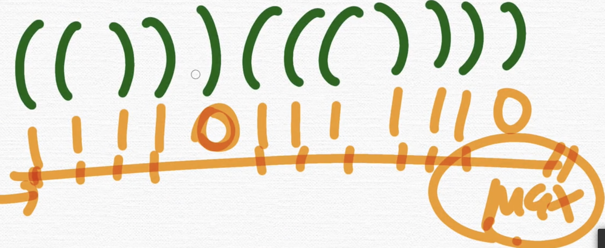

# 14391(종이조각)

## \[1] 이론

### (1) 좌표 나누기 (경우의 수)

<figure><figcaption></figcaption></figure>

### (2) 가로세로 좌표의 경우의 수 세기

<figure><figcaption></figcaption></figure>

```cpp
for (int s = 0; s < (1 << (n * m)); s++) {
        int sum = 0;
        for (int i = 0; i < n; i++) {
            int cur = 0;
            for (int j = 0; j < m; j++) {
                int k = i * m + j;
            }
        }
}
// 1. 모든 칸 경우의 수(한줄)
for(int i=0;i<(1<<(a*b));i++){
    for(int j=0;j<(a*b);j++){
        if(i&(1<<j)){
            cout << "1";
        }
        else{
            cout <<"0";
        }
    }
}
// 2. 가로세로 나누기 경우의 수 
for(int i=0;i<(1<<(a*b));i++){
    for(int y=0;y<a;y++){
       for(int x=0;x<b;x++){
            int k = b + a*i;
            if(i&(1<<k)){
                cout <<"1";
            }
            else{
                cout <<"0";
            }
            cout << "\n";
        } 
    }
}
```

### (3) 좌표의 모든 경우의 수 세기

```cpp
for (int s = 0; s < (1 << (n * m)); s++) {
```
