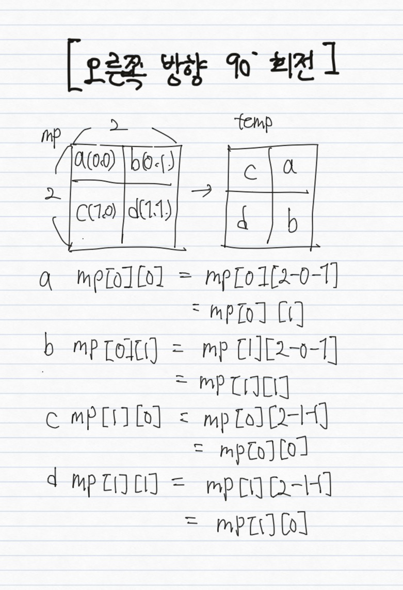

# \[5] 그리디,라인스위핑,투포인터 솔루션

#### (1) 5 - I : 3273

* 투포인터
* 정렬&#x20;

#### _(2) 5 - J : 1700_ 멀티탭 스케줄링



* <mark style="background-color:green;">**문제 분류 : memory paging optimal 알고리즘 구현 문제(스와핑 횟수 최소화)**</mark>
  * .png>)
  * 가장 먼 미래에 참조되는 page
  * <mark style="background-color:green;">**미래에 봤을 때**</mark>
    * .png>)
    * <mark style="background-color:green;">**없는 요소를 지우거나**</mark>
    * <mark style="background-color:green;">**모두 다 존재하면 가장 나중에 오는 요소를 지운다.**</mark>
  * 예시 : 램의 메모리는 한정되있으며 실행할 프로그램이 많을 때 각 페이지를 스와핑함
* 인덱스로 존재 여부를 알고 싶을 때에는 Array-visited를 쓴다. (O(1))

#### (3) _5 - K : 17144_ 미세먼지 안녕!



* <mark style="background-color:green;">**문제 분류1 : 동시에 확산**</mark>
  * <mark style="background-color:green;">**확산 : 네 방향으로 퍼져나감**</mark>
  * <mark style="background-color:green;">**temp 배열 사용 => 동시에 확산되면서 서로 간의 영향을 주지 말아야함**</mark>&#x20;
  * <mark style="background-color:green;">**큐 사용 => 확산할 미세먼지들을 담음**</mark>
* <mark style="background-color:green;">**문제 분류 2 : 공기 청정기의 바람 이동**</mark>&#x20;
  * .png>)
    * 영역들을 미리 뽑아놓고 로테이팅 하는 로직을 구현
    * 배열 한칸씩 뒤로 밀기(리스트)
      * 맨 뒤에서 부터

#### (4) _5 - L : 14889_ 스타트와 링크



<mark style="background-color:green;">**문제 분류 : 비트마스킹 + 구현 문제**</mark>

* <mark style="background-color:green;">**1) 비트 마스킹으로 팀이 이뤄질 모든 경우의 수를 뽑는다.**</mark>
* <mark style="background-color:green;">**2) 이뤄진 팀이 2/N , 2/N을 만족하는지 확인**</mark>&#x20;
  * <mark style="background-color:green;">**비트가 켜져있는지 확인 : a & (1<\<n)**</mark>&#x20;
  * <mark style="background-color:green;">**켜져있으면 start팀 , 꺼져있으면 link팀**</mark>&#x20;
* <mark style="background-color:green;">**3) 능력치 구하기 : 순열**</mark>

#### _(6) 5 - M : 12100_ 2048 (Easy)



* <mark style="background-color:green;">**문제 분류1 :  배열 회전**</mark>
  * <mark style="background-color:green;">**90도 회전 : a\[i]\[j] = a\[n-j-1]\[i]**</mark>
    * 인덱스는 0부터 시작하고 , n은 변의 길이이다.
    * 
* .png>)\\
  * 한방향 로직을 하나 만들어서 로테이트한다.

#### (7) _5 - N : 3190 뱀_



#### (8) 5-O:17406 배열 돌리기 4


